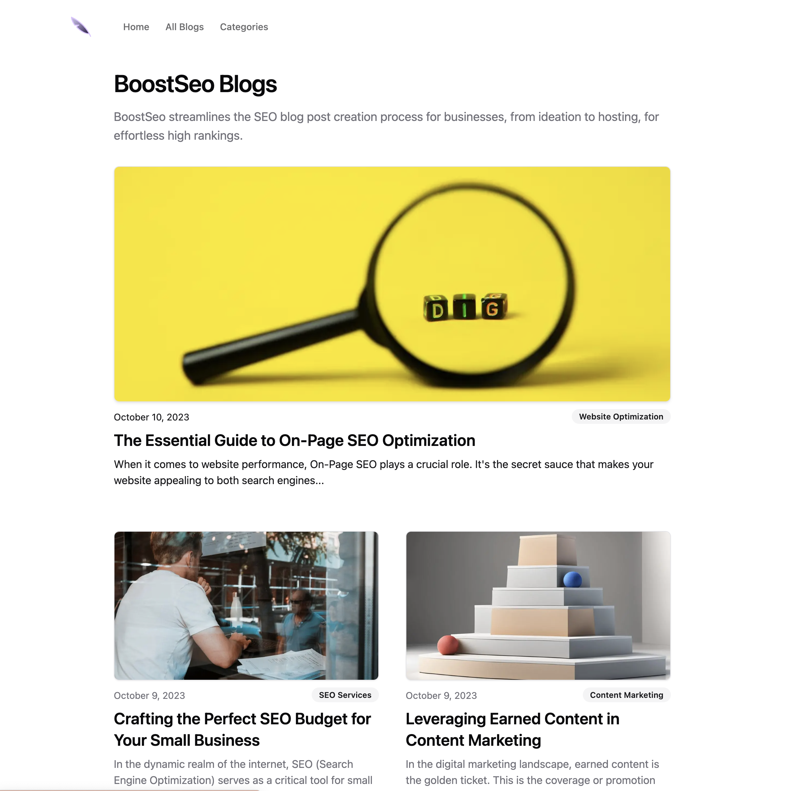
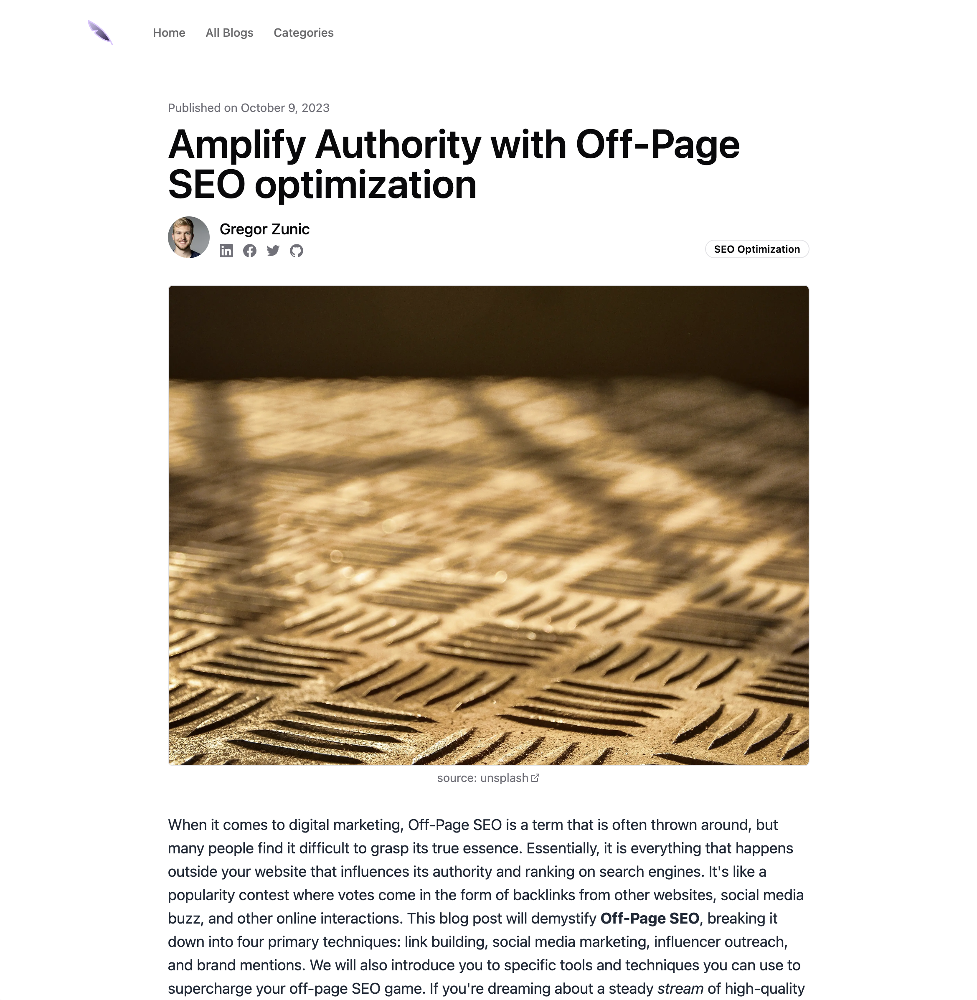
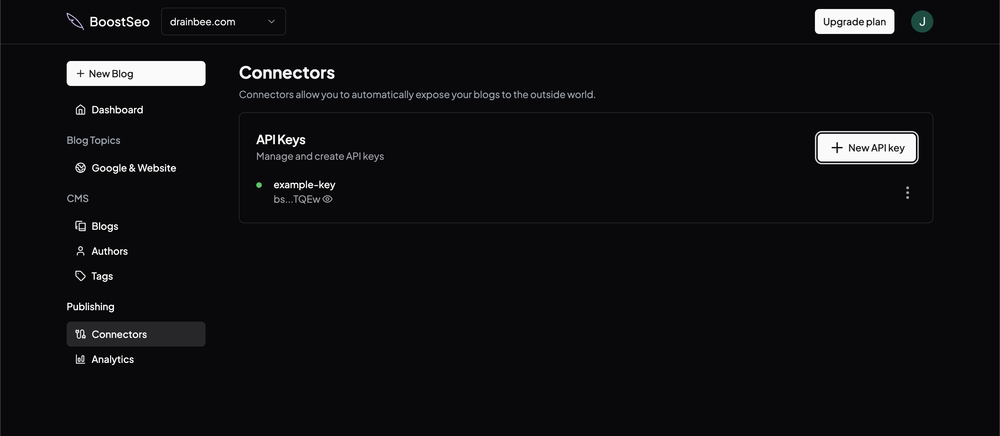
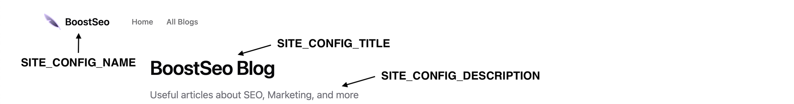

# BoostSeo Hosted Blog with Next.js

Welcome to the starter code template for the Boost SEO hosted blog using Next.js. Tailor this template to your needs, or follow the simple one-click deployment method to launch your blog in minutes.

For inquiries, shoot us an email at info@boostseo.ai.


<table>
<tr>
<td>

</td>
<td align="right">

</td>
</tr>
</table>


## Prerequisites

Based on your requirements, we offer two deployment options:

1. **One Click Deployment**: Ideal if you appreciate [our design](https://boostseo.ai/blogs) but wish to make slight tweaks such as changing the company name, logo, etc.
2. **Customization**: Best suited if you're aiming to modify [our design](https://boostseo.ai/blogs) to align more with your brand identity.

In either scenario, we have environment variables ready to ease your setup.

📌 **Note**: This tutorial is set up to host your blog on a subdomain, like `blog.example.com`. If you wish to have it under a path, like `example.com/blogs`, you'll need to manually integrate the code. While this method requires a bit more effort, our components are designed for flexibility, allowing you to incorporate them as desired.


## Option 1: One Click Deployment

Launch our template on Vercel seamlessly. Hit the button below and follow the on-screen prompts. 

👉 **Note**: Familiarize yourself with [the Environment Variables](#environment-variables) to set them correctly.

[](https://vercel.com/new/clone?repository-url=https%3A%2F%2Fgithub.com%2Fboost-seo%2Ffrontend-template&env=API_KEY,SITE_CONFIG_NAME,SITE_CONFIG_TITLE,SITE_CONFIG_DESCRIPTION,SITE_CONFIG_URL,SITE_CONFIG_MAIN_URL,SITE_CONFIG_LOGO_URL,SITE_CONFIG_FAVICON,SITE_CONFIG_ACTION_TEXT,SITE_CONFIG_ACTION_URL&envDescription=https%3A%2F%2Fgithub.com%2Fboost-seo%2Ffrontend-template%2Fblob%2Fmain%2FREADME.md&envLink=https%3A%2F%2Fgithub.com%2Fboost-seo%2Ffrontend-template%2Fblob%2Fmain%2F.env.example&project-name=boostseo-frontend-nextjs&repository-name=boostseo-frontend-nextjs)

## Option 2: Customization

Choose this for complete control over the design aesthetics.

### Steps:

1. **Clone the Repository**
   ```bash
   git clone https://github.com/boost-seo/frontend-template.git
   ```

2. **Set up Environment Variables**
   
   Dive into the [Environment Variables section](#environment-variables) for a detailed walkthrough.

3. **Install Dependencies**
   ```bash
   # with yarn
   yarn

   # with npm
   npm install
   ```

4. **Start Development Server**
   ```bash
   # with yarn
   yarn dev

   # with npm
   npm run dev
   ```

## Environment Variables

Manage critical configurations like the company name in a centralized .env file. To get started copy the `.env.example` and rename it to `.env`.

 Here's a breakdown of what everything means:

- **API_KEY**: Secure your access. Head over to the [BoostSEO dashboard](https://boostseo.ai/dashboard), visit the `Connectors` section, and generate a fresh API Key.
  
  

- **SITE_CONFIG_NAME**: The text displayed beside the logo.
  
  

- **SITE_CONFIG_TITLE**: Your main site title. It also appears on the browser tab.
  - For an effective SEO boost, opt for concise yet descriptive titles. Typically, 50-60 characters in length is recommended to ensure they display correctly in search engine results.

- **SITE_CONFIG_DESCRIPTION**: This serves as your subtitle and meta description.
  - From an SEO standpoint, keep meta descriptions between 50-160 characters. It should be a brief summary of the content, compelling enough for users to click through.

- **SITE_CONFIG_URL**: Indicate the final URL after deployment. Essential for sitemap configuration. E.g.,  `https://www.blogs.example.com`.

- **SITE_CONFIG_MAIN_URL**: Specify the main website's URL. In our case this would be `https://www.boostseo.ai`.

- **SITE_CONFIG_LOGO_URL**: Logo display settings.
  - **Suggested**: Place the logo under `./public/images/your-image.png`, and reference as `/images/your-image.png`.
  - **Alternative**: Use an external link like `https://...`.

- **SITE_CONFIG_FAVICON**: Modify your site's favicon.
  - **Suggested**: Save your favicon in `./public/favicon/favicon.ico`, and reference as `/favicon/favicon.ico`.
  - **Alternative**: Use an external link like `https://...`.

- **SITE_CONFIG_ACTION_TEXT & SITE_CONFIG_ACTION_URL**: Configure an action button in the top right of the header, as a Call to action.
  

The provided `.env` file lists these variables for easy setup. Remember to uncomment (remove the `#` at the beginning) and configure as needed.

---

With everything set, you're on your way to launching a splendid, SEO-optimized blog. Remember, at BoostSEO, we're always here to help. Happy blogging! 🚀